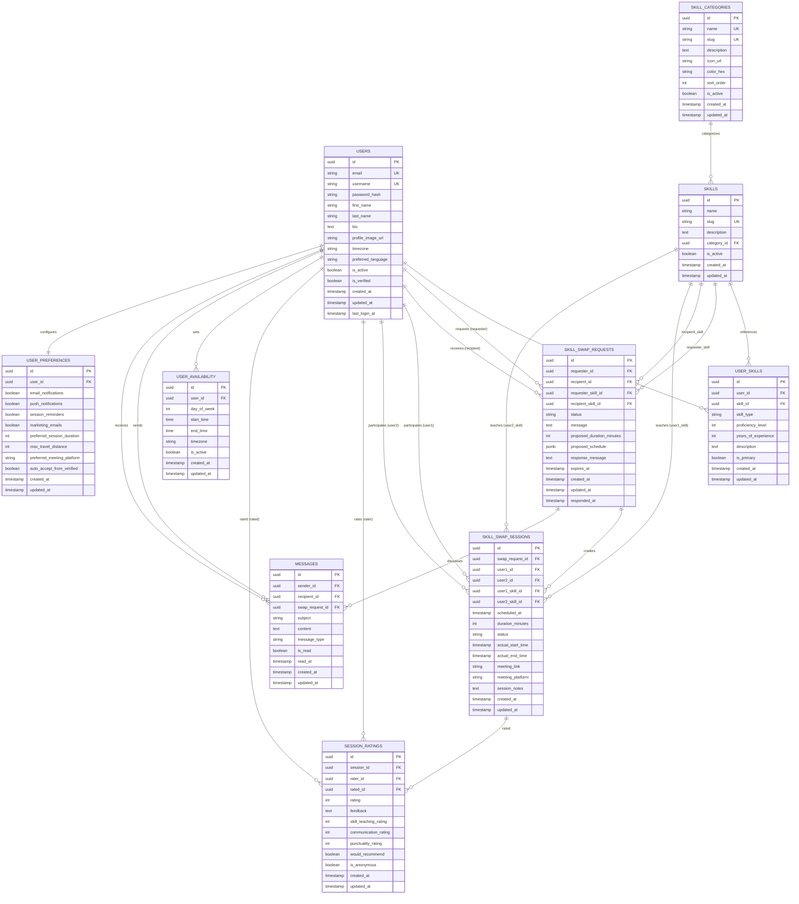

# SkillSwap Database Schema

## Overview

This document defines the database schema for the SkillSwap application, supporting the core functionality of peer-to-peer skill exchange, user management, matching, and session tracking.

## 🔄 Database Visual Schema

### Entity Relationship Diagram



### Simplified ASCII Schema Overview

```
                    ┌─────────────────┐
                    │ SKILL_CATEGORIES│
                    │ (Languages,     │
                    │  Programming,   │
                    │  Music, etc.)   │
                    └─────────┬───────┘
                              │
                              │ 1:N
                              ▼
┌─────────────────┐    ┌─────────────────┐    ┌─────────────────┐
│     USERS       │    │     SKILLS      │    │  USER_SKILLS    │
│ • Authentication│    │ • Skill catalog │    │ • CAN_TEACH     │
│ • Profile info  │    │ • Name, desc    │    │ • WANT_TO_LEARN │
│ • Preferences   │    │ • Category link │    │ • Proficiency   │
└─────────┬───────┘    └─────────┬───────┘    └─────────┬───────┘
          │                      │                      │
          │                      │                      │
          └──────────────────────┼──────────────────────┘
                               │
                   ┌───────────▼─────────────┐
                   │     SKILL_SWAP_REQUESTS │
                   │ • Requester + Recipient │
                   │ • Skills to exchange    │
                   │ • Status (pending/accepted) │
                   │ • Proposed schedule     │
                   └───────────────┬────────┘
                                   │
                                   │ 1:N
                                   ▼
                   ┌───────────────────────────────┐
                   │     SKILL_SWAP_SESSIONS       │
                   │ • Actual scheduled sessions   │
                   │ • Meeting details             │
                   │ • Status tracking             │
                   └───────────────┬───────────────┘
                                   │
                                   │ 1:N
                                   ▼
                   ┌───────────────────────────────┐
                   │      SESSION_RATINGS          │
                   │ • Post-session feedback       │
                   │ • Multi-dimensional ratings   │
                   │ • Teaching quality scores     │
                   └───────────────────────────────┘

Supporting Tables:
┌─────────────────┐  ┌─────────────────┐  ┌─────────────────┐
│ USER_AVAILABILITY│  │    MESSAGES     │  │ USER_PREFERENCES│
│ • Time slots    │  │ • Communication │  │ • Settings      │
│ • Timezone      │  │ • Coordination  │  │ • Notifications │
└─────────────────┘  └─────────────────┘  └─────────────────┘
```

### Core Relationships Summary

1. **Users ↔ Skills** (Many-to-Many via USER_SKILLS)

   - Users can teach multiple skills
   - Users can want to learn multiple skills
   - Each relationship has proficiency level and type

2. **Skill Swap Request Flow**

   ```
   User A (teaches Spanish, wants English)
      ↓ creates request to
   User B (teaches English, wants Spanish)
      ↓ accepts request, creates
   Skill Swap Session (scheduled meeting)
      ↓ after completion, both create
   Session Ratings (feedback for each other)
   ```

3. **Communication Flow**

   ```
   Skill Swap Request → Messages (coordination)
   Users ↔ Messages (general communication)
   ```

4. **User Support Tables**
   - **USER_AVAILABILITY**: When users are free for sessions
   - **USER_PREFERENCES**: Notification and platform preferences
   - **MESSAGES**: All communication between users

## 🗄️ Core Entities

### 1. Users Table

**Purpose**: Store user account information and authentication data

```sql
CREATE TABLE users (
    id UUID PRIMARY KEY DEFAULT gen_random_uuid(),
    email VARCHAR(255) UNIQUE NOT NULL,
    username VARCHAR(50) UNIQUE NOT NULL,
    password_hash VARCHAR(255) NOT NULL,
    first_name VARCHAR(100) NOT NULL,
    last_name VARCHAR(100) NOT NULL,
    bio TEXT,
    profile_image_url VARCHAR(500),
    timezone VARCHAR(50),
    preferred_language VARCHAR(10) DEFAULT 'en',
    is_active BOOLEAN DEFAULT true,
    is_verified BOOLEAN DEFAULT false,
    created_at TIMESTAMP DEFAULT CURRENT_TIMESTAMP,
    updated_at TIMESTAMP DEFAULT CURRENT_TIMESTAMP,
    last_login_at TIMESTAMP
);

-- Indexes
CREATE INDEX idx_users_email ON users(email);
CREATE INDEX idx_users_username ON users(username);
CREATE INDEX idx_users_is_active ON users(is_active);
```

### 2. Skills Table

**Purpose**: Catalog of available skills in the system

```sql
CREATE TABLE skills (
    id UUID PRIMARY KEY DEFAULT gen_random_uuid(),
    name VARCHAR(100) NOT NULL,
    slug VARCHAR(100) UNIQUE NOT NULL,
    description TEXT,
    category_id UUID NOT NULL, -- New foreign key relationship
    is_active BOOLEAN DEFAULT true,
    created_at TIMESTAMP DEFAULT CURRENT_TIMESTAMP,
    updated_at TIMESTAMP DEFAULT CURRENT_TIMESTAMP,

    CONSTRAINT fk_skills_category FOREIGN KEY (category_id) REFERENCES skill_categories(id)
);

-- Indexes
CREATE INDEX idx_skills_category ON skills(category_id);
CREATE INDEX idx_skills_slug ON skills(slug);
CREATE INDEX idx_skills_is_active ON skills(is_active);
```

### 3. Skill Categories Table

**Purpose**: Organize skills into categories (Languages, Programming, Music, etc.)

```sql
CREATE TABLE skill_categories (
    id UUID PRIMARY KEY DEFAULT gen_random_uuid(),
    name VARCHAR(100) UNIQUE NOT NULL,
    slug VARCHAR(100) UNIQUE NOT NULL,
    description TEXT,
    icon_url VARCHAR(500),
    color_hex VARCHAR(7), -- For UI theming
    sort_order INTEGER DEFAULT 0,
    is_active BOOLEAN DEFAULT true,
    created_at TIMESTAMP DEFAULT CURRENT_TIMESTAMP,
    updated_at TIMESTAMP DEFAULT CURRENT_TIMESTAMP
);

-- Indexes
CREATE INDEX idx_skill_categories_slug ON skill_categories(slug);
CREATE INDEX idx_skill_categories_sort_order ON skill_categories(sort_order);
```

### 4. User Skills Table

**Purpose**: Link users to skills they can teach or want to learn

```sql
CREATE TABLE user_skills (
    id UUID PRIMARY KEY DEFAULT gen_random_uuid(),
    user_id UUID NOT NULL,
    skill_id UUID NOT NULL,
    skill_type VARCHAR(20) NOT NULL, -- 'CAN_TEACH' or 'WANT_TO_LEARN'
    proficiency_level INTEGER CHECK (proficiency_level >= 1 AND proficiency_level <= 5), -- 1=Beginner, 5=Expert
    years_of_experience INTEGER,
    description TEXT, -- User's specific description of their skill level/experience
    is_primary BOOLEAN DEFAULT false, -- Is this a primary skill for the user?
    created_at TIMESTAMP DEFAULT CURRENT_TIMESTAMP,
    updated_at TIMESTAMP DEFAULT CURRENT_TIMESTAMP,

    CONSTRAINT fk_user_skills_user FOREIGN KEY (user_id) REFERENCES users(id) ON DELETE CASCADE,
    CONSTRAINT fk_user_skills_skill FOREIGN KEY (skill_id) REFERENCES skills(id),
    CONSTRAINT uq_user_skills_unique UNIQUE (user_id, skill_id, skill_type)
);

-- Indexes
CREATE INDEX idx_user_skills_user ON user_skills(user_id);
CREATE INDEX idx_user_skills_skill ON user_skills(skill_id);
CREATE INDEX idx_user_skills_type ON user_skills(skill_type);
CREATE INDEX idx_user_skills_proficiency ON user_skills(proficiency_level);
```

### 5. Skill Swap Requests Table

**Purpose**: Track requests between users for skill exchanges

```sql
CREATE TABLE skill_swap_requests (
    id UUID PRIMARY KEY DEFAULT gen_random_uuid(),
    requester_id UUID NOT NULL,
    recipient_id UUID NOT NULL,
    requester_skill_id UUID NOT NULL, -- What the requester wants to learn
    recipient_skill_id UUID NOT NULL, -- What the recipient can teach
    status VARCHAR(20) DEFAULT 'PENDING', -- PENDING, ACCEPTED, DECLINED, CANCELLED
    message TEXT, -- Personal message from requester
    proposed_duration_minutes INTEGER DEFAULT 60,
    proposed_schedule JSONB, -- Array of proposed time slots
    response_message TEXT, -- Response from recipient
    expires_at TIMESTAMP, -- When the request expires
    created_at TIMESTAMP DEFAULT CURRENT_TIMESTAMP,
    updated_at TIMESTAMP DEFAULT CURRENT_TIMESTAMP,
    responded_at TIMESTAMP,

    CONSTRAINT fk_swap_requests_requester FOREIGN KEY (requester_id) REFERENCES users(id),
    CONSTRAINT fk_swap_requests_recipient FOREIGN KEY (recipient_id) REFERENCES users(id),
    CONSTRAINT fk_swap_requests_req_skill FOREIGN KEY (requester_skill_id) REFERENCES skills(id),
    CONSTRAINT fk_swap_requests_rec_skill FOREIGN KEY (recipient_skill_id) REFERENCES skills(id),
    CONSTRAINT chk_swap_requests_different_users CHECK (requester_id != recipient_id)
);

-- Indexes
CREATE INDEX idx_swap_requests_requester ON skill_swap_requests(requester_id);
CREATE INDEX idx_swap_requests_recipient ON skill_swap_requests(recipient_id);
CREATE INDEX idx_swap_requests_status ON skill_swap_requests(status);
CREATE INDEX idx_swap_requests_expires ON skill_swap_requests(expires_at);
```

### 6. Skill Swap Sessions Table

**Purpose**: Track actual skill exchange sessions

```sql
CREATE TABLE skill_swap_sessions (
    id UUID PRIMARY KEY DEFAULT gen_random_uuid(),
    swap_request_id UUID NOT NULL,
    user1_id UUID NOT NULL, -- First participant
    user2_id UUID NOT NULL, -- Second participant
    user1_skill_id UUID NOT NULL, -- Skill user1 is teaching
    user2_skill_id UUID NOT NULL, -- Skill user2 is teaching
    scheduled_at TIMESTAMP NOT NULL,
    duration_minutes INTEGER DEFAULT 60,
    status VARCHAR(20) DEFAULT 'SCHEDULED', -- SCHEDULED, IN_PROGRESS, COMPLETED, CANCELLED, NO_SHOW
    actual_start_time TIMESTAMP,
    actual_end_time TIMESTAMP,
    meeting_link VARCHAR(500), -- Zoom, Google Meet, etc.
    meeting_platform VARCHAR(50), -- 'zoom', 'google_meet', 'built_in', etc.
    session_notes TEXT,
    created_at TIMESTAMP DEFAULT CURRENT_TIMESTAMP,
    updated_at TIMESTAMP DEFAULT CURRENT_TIMESTAMP,

    CONSTRAINT fk_swap_sessions_request FOREIGN KEY (swap_request_id) REFERENCES skill_swap_requests(id),
    CONSTRAINT fk_swap_sessions_user1 FOREIGN KEY (user1_id) REFERENCES users(id),
    CONSTRAINT fk_swap_sessions_user2 FOREIGN KEY (user2_id) REFERENCES users(id),
    CONSTRAINT fk_swap_sessions_user1_skill FOREIGN KEY (user1_skill_id) REFERENCES skills(id),
    CONSTRAINT fk_swap_sessions_user2_skill FOREIGN KEY (user2_skill_id) REFERENCES skills(id)
);

-- Indexes
CREATE INDEX idx_swap_sessions_request ON skill_swap_sessions(swap_request_id);
CREATE INDEX idx_swap_sessions_user1 ON skill_swap_sessions(user1_id);
CREATE INDEX idx_swap_sessions_user2 ON skill_swap_sessions(user2_id);
CREATE INDEX idx_swap_sessions_scheduled ON skill_swap_sessions(scheduled_at);
CREATE INDEX idx_swap_sessions_status ON skill_swap_sessions(status);
```

### 7. Session Ratings Table

**Purpose**: Store user ratings and feedback for completed sessions

```sql
CREATE TABLE session_ratings (
    id UUID PRIMARY KEY DEFAULT gen_random_uuid(),
    session_id UUID NOT NULL,
    rater_id UUID NOT NULL, -- Who is giving the rating
    rated_id UUID NOT NULL, -- Who is being rated
    rating INTEGER CHECK (rating >= 1 AND rating <= 5), -- 1-5 star rating
    feedback TEXT,
    skill_teaching_rating INTEGER CHECK (skill_teaching_rating >= 1 AND skill_teaching_rating <= 5),
    communication_rating INTEGER CHECK (communication_rating >= 1 AND communication_rating <= 5),
    punctuality_rating INTEGER CHECK (punctuality_rating >= 1 AND punctuality_rating <= 5),
    would_recommend BOOLEAN,
    is_anonymous BOOLEAN DEFAULT false,
    created_at TIMESTAMP DEFAULT CURRENT_TIMESTAMP,
    updated_at TIMESTAMP DEFAULT CURRENT_TIMESTAMP,

    CONSTRAINT fk_session_ratings_session FOREIGN KEY (session_id) REFERENCES skill_swap_sessions(id),
    CONSTRAINT fk_session_ratings_rater FOREIGN KEY (rater_id) REFERENCES users(id),
    CONSTRAINT fk_session_ratings_rated FOREIGN KEY (rated_id) REFERENCES users(id),
    CONSTRAINT uq_session_ratings_unique UNIQUE (session_id, rater_id)
);

-- Indexes
CREATE INDEX idx_session_ratings_session ON session_ratings(session_id);
CREATE INDEX idx_session_ratings_rated ON session_ratings(rated_id);
CREATE INDEX idx_session_ratings_rating ON session_ratings(rating);
```

### 8. User Availability Table

**Purpose**: Store user availability for scheduling sessions

```sql
CREATE TABLE user_availability (
    id UUID PRIMARY KEY DEFAULT gen_random_uuid(),
    user_id UUID NOT NULL,
    day_of_week INTEGER CHECK (day_of_week >= 0 AND day_of_week <= 6), -- 0=Sunday, 6=Saturday
    start_time TIME NOT NULL,
    end_time TIME NOT NULL,
    timezone VARCHAR(50) NOT NULL,
    is_active BOOLEAN DEFAULT true,
    created_at TIMESTAMP DEFAULT CURRENT_TIMESTAMP,
    updated_at TIMESTAMP DEFAULT CURRENT_TIMESTAMP,

    CONSTRAINT fk_user_availability_user FOREIGN KEY (user_id) REFERENCES users(id) ON DELETE CASCADE,
    CONSTRAINT chk_availability_time CHECK (start_time < end_time)
);

-- Indexes
CREATE INDEX idx_user_availability_user ON user_availability(user_id);
CREATE INDEX idx_user_availability_day ON user_availability(day_of_week);
CREATE INDEX idx_user_availability_active ON user_availability(is_active);
```

### 9. Messages Table

**Purpose**: Store messages between users for coordination

```sql
CREATE TABLE messages (
    id UUID PRIMARY KEY DEFAULT gen_random_uuid(),
    sender_id UUID NOT NULL,
    recipient_id UUID NOT NULL,
    swap_request_id UUID, -- Optional: link to specific swap request
    subject VARCHAR(255),
    content TEXT NOT NULL,
    message_type VARCHAR(20) DEFAULT 'GENERAL', -- GENERAL, SWAP_COORDINATION, SYSTEM
    is_read BOOLEAN DEFAULT false,
    read_at TIMESTAMP,
    created_at TIMESTAMP DEFAULT CURRENT_TIMESTAMP,
    updated_at TIMESTAMP DEFAULT CURRENT_TIMESTAMP,

    CONSTRAINT fk_messages_sender FOREIGN KEY (sender_id) REFERENCES users(id),
    CONSTRAINT fk_messages_recipient FOREIGN KEY (recipient_id) REFERENCES users(id),
    CONSTRAINT fk_messages_swap_request FOREIGN KEY (swap_request_id) REFERENCES skill_swap_requests(id)
);

-- Indexes
CREATE INDEX idx_messages_recipient ON messages(recipient_id);
CREATE INDEX idx_messages_sender ON messages(sender_id);
CREATE INDEX idx_messages_swap_request ON messages(swap_request_id);
CREATE INDEX idx_messages_is_read ON messages(is_read);
CREATE INDEX idx_messages_created ON messages(created_at DESC);
```

### 10. User Preferences Table

**Purpose**: Store user preferences and settings

```sql
CREATE TABLE user_preferences (
    id UUID PRIMARY KEY DEFAULT gen_random_uuid(),
    user_id UUID NOT NULL,
    email_notifications BOOLEAN DEFAULT true,
    push_notifications BOOLEAN DEFAULT true,
    session_reminders BOOLEAN DEFAULT true,
    marketing_emails BOOLEAN DEFAULT false,
    preferred_session_duration INTEGER DEFAULT 60, -- in minutes
    max_travel_distance INTEGER, -- for in-person sessions (future feature)
    preferred_meeting_platform VARCHAR(50), -- 'zoom', 'google_meet', 'built_in'
    auto_accept_from_verified BOOLEAN DEFAULT false,
    created_at TIMESTAMP DEFAULT CURRENT_TIMESTAMP,
    updated_at TIMESTAMP DEFAULT CURRENT_TIMESTAMP,

    CONSTRAINT fk_user_preferences_user FOREIGN KEY (user_id) REFERENCES users(id) ON DELETE CASCADE,
    CONSTRAINT uq_user_preferences_unique UNIQUE (user_id)
);

-- Indexes
CREATE INDEX idx_user_preferences_user ON user_preferences(user_id);
```

## 🚀 Initial Data Seeds

### Skill Categories

```sql
INSERT INTO skill_categories (id, name, slug, description, sort_order) VALUES
(gen_random_uuid(), 'Languages', 'languages', 'Spoken and written languages', 1),
(gen_random_uuid(), 'Programming', 'programming', 'Software development and coding', 2),
(gen_random_uuid(), 'Music', 'music', 'Musical instruments and theory', 3),
(gen_random_uuid(), 'Arts & Design', 'arts-design', 'Visual arts, design, and creativity', 4),
(gen_random_uuid(), 'Business', 'business', 'Business skills and entrepreneurship', 5),
(gen_random_uuid(), 'Sports & Fitness', 'sports-fitness', 'Physical activities and wellness', 6),
(gen_random_uuid(), 'Cooking', 'cooking', 'Culinary skills and food preparation', 7),
(gen_random_uuid(), 'Academic', 'academic', 'Academic subjects and tutoring', 8);
```

### Sample Skills for Language Category

```sql
-- Assuming we have the Languages category ID
INSERT INTO skills (name, slug, description, category_id) VALUES
('English', 'english', 'English language conversation and grammar',
    (SELECT id FROM skill_categories WHERE slug = 'languages')),
('Spanish', 'spanish', 'Spanish language conversation and grammar',
    (SELECT id FROM skill_categories WHERE slug = 'languages')),
('French', 'french', 'French language conversation and grammar',
    (SELECT id FROM skill_categories WHERE slug = 'languages')),
('Mandarin Chinese', 'mandarin-chinese', 'Mandarin Chinese conversation and characters',
    (SELECT id FROM skill_categories WHERE slug = 'languages')),
('Japanese', 'japanese', 'Japanese language and writing systems',
    (SELECT id FROM skill_categories WHERE slug = 'languages'));
```

## 🔍 Key Queries for Application

### Find Potential Matches

```sql
-- Find users who can teach what I want to learn and want to learn what I can teach
WITH my_skills_to_teach AS (
    SELECT skill_id FROM user_skills
    WHERE user_id = $1 AND skill_type = 'CAN_TEACH'
),
my_skills_to_learn AS (
    SELECT skill_id FROM user_skills
    WHERE user_id = $1 AND skill_type = 'WANT_TO_LEARN'
)
SELECT DISTINCT u.*, us1.skill_id as they_can_teach, us2.skill_id as they_want_to_learn
FROM users u
JOIN user_skills us1 ON u.id = us1.user_id
JOIN user_skills us2 ON u.id = us2.user_id
WHERE u.id != $1
  AND u.is_active = true
  AND us1.skill_type = 'CAN_TEACH'
  AND us1.skill_id IN (SELECT skill_id FROM my_skills_to_learn)
  AND us2.skill_type = 'WANT_TO_LEARN'
  AND us2.skill_id IN (SELECT skill_id FROM my_skills_to_teach);
```

### User Dashboard Statistics

```sql
-- Get user stats for dashboard
SELECT
    COUNT(CASE WHEN ssr.status = 'PENDING' THEN 1 END) as pending_requests,
    COUNT(CASE WHEN ssr.status = 'ACCEPTED' THEN 1 END) as accepted_requests,
    COUNT(CASE WHEN sss.status = 'COMPLETED' THEN 1 END) as completed_sessions,
    COALESCE(AVG(sr.rating), 0) as average_rating
FROM users u
LEFT JOIN skill_swap_requests ssr ON u.id = ssr.requester_id OR u.id = ssr.recipient_id
LEFT JOIN skill_swap_sessions sss ON u.id = sss.user1_id OR u.id = sss.user2_id
LEFT JOIN session_ratings sr ON u.id = sr.rated_id
WHERE u.id = $1;
```

## 📊 Database Indexes Strategy

### Performance Considerations

1. **User lookups**: Email and username indexes for authentication
2. **Skill matching**: Composite indexes on user_skills for efficient matching
3. **Session scheduling**: Indexes on availability and scheduled sessions
4. **Message querying**: Recipient and timestamp indexes for inbox functionality
5. **Rating aggregation**: Indexes on rated_id for calculating user ratings

### Partitioning Considerations (Future)

- **Messages**: Partition by month for better performance on large datasets
- **Session Ratings**: Partition by creation date
- **Skill Swap Sessions**: Partition by scheduled date

## 🔒 Security Considerations

### Row Level Security (Future Enhancement)

```sql
-- Example RLS policy for user data
CREATE POLICY user_own_data ON user_skills
FOR ALL TO authenticated_user
USING (user_id = current_user_id());
```

### Data Privacy

- Password hashing (handled in application layer)
- Email verification tokens (separate table if needed)
- Personal information protection
- GDPR compliance considerations (user data deletion)

## 🚀 Migration Strategy

### Phase 1: Core Tables

1. Users and authentication
2. Skills and categories
3. User skills relationships

### Phase 2: Matching System

4. Skill swap requests
5. Messages
6. User availability

### Phase 3: Session Management

7. Skill swap sessions
8. Session ratings
9. User preferences

This schema supports the core SkillSwap functionality while maintaining flexibility for future enhancements and scalability.
